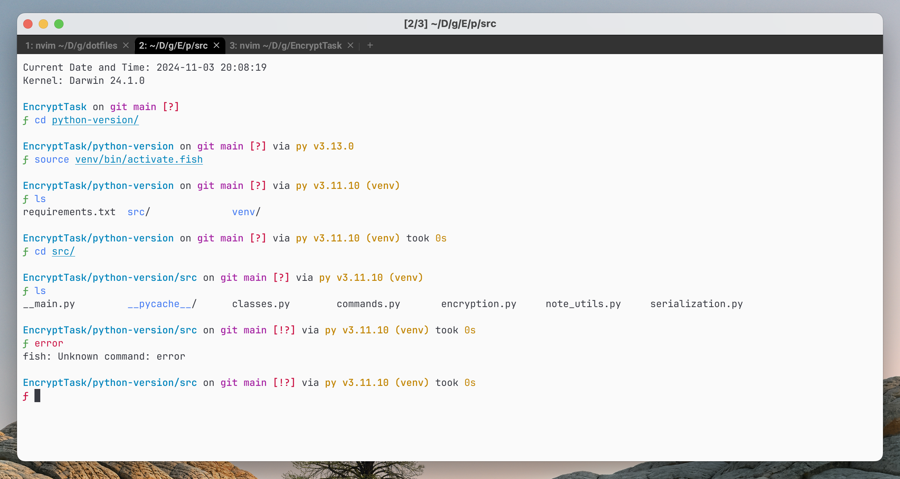
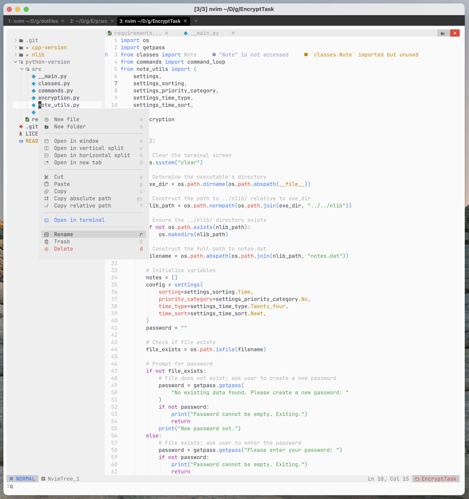

# Dotfiles

**WezTerm+Fish+Starship**


**NvChad(nvim)**


These are my awesome dotfiles, and you are welcome to use them.

This repository includes configurations for

1. NvChad `configs/nvim/lua`,
2. WezTerm `configs/terminal/.wezterm.lua`,
3. Fish `configs/terminal/config.fish`,
4. Starship `configs/terminal/starship.toml`.

_These configs were made for Apple Silicon, so you may need to change some paths._

_If you are going to use NvChad (Neovim), check `configs/nvim/lua/mappings.lua`._

_Included plugins for NvChad (Neovim) are listed at the end. - [All Plugins NvChad (nvim)](#all-plugins-nvchad-nvim)_

**If you find this config useful, please consider giving it a ⭐ to support Me**

## Table of Contents

- [Dependencies](#dependencies)
  - [Fonts](#fonts)
  - [NvChad (nvim)](#for-nvchad-nvim)
  - [WezTerm](#wezterm)
  - [Fish and Starship](#fish-and-starship)
- [Install](#install)
- [All Plugins](#all-plugins-nvchad-nvim)
- [Acknowledgements](#Acknowledgements)

## Dependencies

### Fonts

You need these fonts for **WezTerm** and **NvChad (nvim)**:

- Install JetBrains Mono (https://github.com/JetBrains/JetBrainsMono#installation)
- Install Hack Nerd Font (https://github.com/ryanoasis/nerd-fonts?tab=readme-ov-file#font-installation)

### For NvChad (nvim)

- Install Neovim (https://github.com/neovim/neovim#install-from-package)
- Install NvChad (https://nvchad.com/docs/quickstart/install)

- For the gelguy/wilder plugin, create a venv in the **nvim config folder** and install pynvim via pip:

```shell
python3 -m venv venv
pip3 install pynvim
```

- Add these lines to `init.lua` (in nvim folder root) (change those marked with comments):

```lua
-- path to base46 folder
vim.g.base46_cache = vim.fn.stdpath "data" .. "/base46/"
vim.g.mapleader = " "
-- path to your shell
vim.o.shell = "/opt/homebrew/bin/fish"
-- path to your python3 in venv (for gelguy/wilder)
vim.g.python3_host_prog = ""
vim.g.loaded_python3_provider = 1
```

### WezTerm

- Install WezTerm (https://wezfurlong.org/wezterm/installation)
- Change this line to your shell path:

```lua
-- Set shell path
config.default_prog = { "/opt/homebrew/bin/fish", "-l" }
```

### Fish and Starship

- Install Fish Shell (https://github.com/fish-shell/fish-shell#getting-fish)
- Install Starship (https://github.com/starship/starship#-installation)
- Change this line in `config.fish` to your Starship path:

```fish
# set your shell
/opt/homebrew/bin/starship init fish | source
```

## Install

You should manually choose configs that you need and copy these files to their specific directories:

- `configs/terminal/.wezterm.lua` should be placed in `~/.config`
- `configs/terminal/config.fish` should be placed in `~/.config/fish/`
- `configs/terminal/starship.toml` should be placed in `~/.config`
- `config/nvim/lua` (entire folder) should be placed in `~/.config/nvim`

After copying:

For Fish/Starship/WezTerm:

1. Restart the applications to apply changes

For NvChad config:

1. Open Neovim and wait for packages to install
2. (x2) Restart and run `:MasonInstallAll`
3. (x2) Restart again and run `:Lazy sync`

If you encounter any issues or have questions, please feel free to open an issue on the project's GitHub repository.

## All Plugins NvChad (nvim)

### 1. Lazy

- [williamboman/mason.nvim](https://github.com/williamboman/mason.nvim)
- [williamboman/mason-lspconfig.nvim](https://github.com/williamboman/mason-lspconfig.nvim)
- [neovim/nvim-lspconfig](https://github.com/neovim/nvim-lspconfig)
- [kdheepak/lazygit.nvim](https://github.com/kdheepak/lazygit.nvim)
- [voldikss/vim-floaterm](https://github.com/voldikss/vim-floaterm)
- [folke/trouble.nvim](https://github.com/folke/trouble.nvim)
- [nvim-lua/plenary.nvim](https://github.com/nvim-lua/plenary.nvim)
- [folke/todo-comments.nvim](https://github.com/folke/todo-comments.nvim)
- [nvchad/ui](https://github.com/NvChad/ui)
- [nvchad/base46](https://github.com/NvChad/base46)
- [nvimtools/none-ls.nvim](https://github.com/nvimtools/none-ls.nvim)
- [mfussenegger/nvim-lint](https://github.com/mfussenegger/nvim-lint)
- [stevearc/conform.nvim](https://github.com/stevearc/conform.nvim)
- [windwp/nvim-ts-autotag](https://github.com/windwp/nvim-ts-autotag)
- [olexsmir/gopher.nvim](https://github.com/olexsmir/gopher.nvim)
- [mrcjkb/rustaceanvim](https://github.com/mrcjkb/rustaceanvim)
- [b0o/schemastore.nvim](https://github.com/b0o/schemastore.nvim)
- [nvim-treesitter/nvim-treesitter](https://github.com/nvim-treesitter/nvim-treesitter)
- [tpope/vim-fugitive](https://github.com/tpope/vim-fugitive)
- [gelguy/wilder.nvim](https://github.com/gelguy/wilder.nvim)

### 2. Mason

- **Linters:**

  - `luacheck`

- **LSP Servers:**

  - `lua-language-server`
  - `html-lsp`
  - `css-lsp`
  - `typescript-language-server`
  - `tailwindcss-language-server`
  - `pyright`
  - `ruff-lsp`
  - `rust-analyzer`
  - `gopls`
  - `clangd`

- **Formatters:**

  - `stylua`
  - `prettierd`
  - `clang-format`
  - `black`
  - `gofumpt`
  - `rustfmt`

- **Analysis Tools:**

  - `mypy`
  - `eslint_d`
  - `luacheck`
  - `golangci-lint`

## Acknowledgements

**Disclaimer**: I am not the creator of the plugins included in this configuration. All plugins are the work of their respective authors. Please review the licenses of each plugin before using or modifying them in your own projects.
