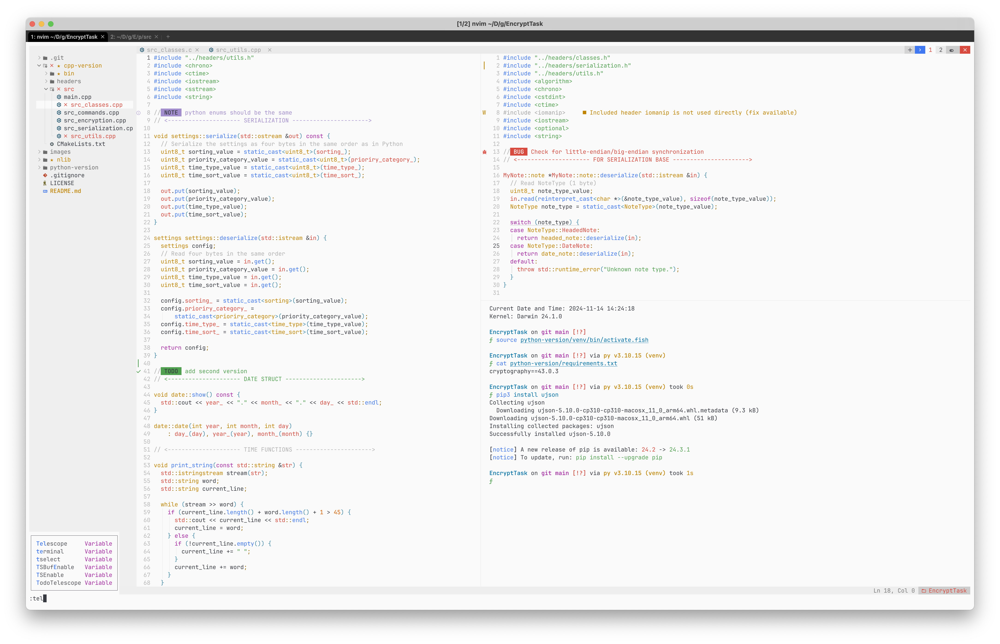

# .dotfiles

**If you find this config useful, please consider giving it a ⭐ to support Me**

1. NvChad `configs/nvim/lua`,
2. WezTerm `configs/terminal/.wezterm.lua`,
3. Fish `configs/terminal/config.fish`,
4. Starship `configs/terminal/starship.toml`.

## Table of Contents

- [Dependencies](#dependencies)
  - [Fonts](#fonts)
  - [NvChad (nvim)](#for-nvchad-nvim)
  - [WezTerm](#wezterm)
  - [Fish and Starship](#fish-and-starship)
- [Install](#install)
- [All Plugins](#all-plugins-nvchad-nvim)
- [Acknowledgements](#Acknowledgements)

## Dependencies

### Fonts

You need these fonts for **WezTerm** and **NvChad (nvim)**:

- Install JetBrains Mono (https://github.com/JetBrains/JetBrainsMono#installation)
- Install Hack Nerd Font (https://github.com/ryanoasis/nerd-fonts?tab=readme-ov-file#font-installation)

### For NvChad (nvim)

- Install Neovim (https://github.com/neovim/neovim#install-from-package)
- Install NvChad (https://nvchad.com/docs/quickstart/install)

### WezTerm

- Install WezTerm (https://wezfurlong.org/wezterm/installation)

### Fish and Starship

- Install Fish Shell (https://github.com/fish-shell/fish-shell#getting-fish)
- Install Starship (https://github.com/starship/starship#-installation)

## Install

You should manually choose configs that you need and copy these files to their specific directories:

- `configs/terminal/.wezterm.lua` should be placed in `~/.config`
  - change **fish-shell path**
- `configs/terminal/config.fish` should be placed in `~/.config/fish/`
  - change **starship path**
- `configs/terminal/starship.toml` should be placed in `~/.config`
- `config/nvim/lua` (entire folder) should be placed in `~/.config/nvim`
  - change **paths** at `config/nvim/init.lua`

If you encounter any issues or have questions, please feel free to open an issue on the project's GitHub repository.

## All Plugins NvChad (nvim)

### 1. Lazy

General:

- [williamboman/mason.nvim](https://github.com/williamboman/mason.nvim)
- [williamboman/mason-lspconfig.nvim](https://github.com/williamboman/mason-lspconfig.nvim)
- [neovim/nvim-lspconfig](https://github.com/neovim/nvim-lspconfig)
- [kdheepak/lazygit.nvim](https://github.com/kdheepak/lazygit.nvim)
- [voldikss/vim-floaterm](https://github.com/voldikss/vim-floaterm)
- [folke/trouble.nvim](https://github.com/folke/trouble.nvim)
- [nvim-lua/plenary.nvim](https://github.com/nvim-lua/plenary.nvim)
- [folke/todo-comments.nvim](https://github.com/folke/todo-comments.nvim)
- [nvchad/ui](https://github.com/NvChad/ui)
- [nvchad/base46](https://github.com/NvChad/base46)
- [nvimtools/none-ls.nvim](https://github.com/nvimtools/none-ls.nvim)
- [mfussenegger/nvim-lint](https://github.com/mfussenegger/nvim-lint)
- [stevearc/conform.nvim](https://github.com/stevearc/conform.nvim)
- [windwp/nvim-ts-autotag](https://github.com/windwp/nvim-ts-autotag)
- [olexsmir/gopher.nvim](https://github.com/olexsmir/gopher.nvim)
- [mrcjkb/rustaceanvim](https://github.com/mrcjkb/rustaceanvim)
- [b0o/schemastore.nvim](https://github.com/b0o/schemastore.nvim)
- [nvim-treesitter/nvim-treesitter](https://github.com/nvim-treesitter/nvim-treesitter)
- [tpope/vim-fugitive](https://github.com/tpope/vim-fugitive)
- [nvchad/showkeys](https://github.com/nvzone/showkeys)
- [hrsh7th/nvim-cmp](https://github.com/hrsh7th/nvim-cmp)
- [github/copilot.vim](https://github.com/github/copilot.vim)

  For nvim-cmp:

- [hrsh7th/cmp-buffer](https://github.com/hrsh7th/cmp-buffer)
- [hrsh7th/cmp-path](https://github.com/hrsh7th/cmp-path)
- [saadparwaiz1/cmp_luasnip](https://github.com/saadparwaiz1/cmp_luasnip)
- [hrsh7th/cmp-cmdline](https://github.com/hrsh7th/cmp-cmdline)
- [L3MON4D3/LuaSnip](https://github.com/L3MON4D3/LuaSnip)
- [rafamadriz/friendly-snippets](https://github.com/rafamadriz/friendly-snippets)
- [hrsh7th/cmp-nvim-lsp](https://github.com/hrsh7th/cmp-nvim-lsp)
- [onsails/lspkind-nvim](https://github.com/onsails/lspkind-nvim)

### 2. Mason

- **Linters:**

  - `luacheck`

- **LSP Servers:**

  - `lua-language-server`
  - `html-lsp`
  - `css-lsp`
  - `typescript-language-server`
  - `tailwindcss-language-server`
  - `pyright`
  - `ruff`
  - `rust-analyzer`
  - `gopls`
  - `clangd`

- **Formatters:**

  - `stylua`
  - `prettierd`
  - `clang-format`
  - `black`
  - `gofumpt`
  - `rustfmt`

- **Analysis Tools:**

  - `mypy`
  - `eslint_d`
  - `luacheck`
  - `golangci-lint`

## Acknowledgements

**Disclaimer**: I am not the creator of the plugins included in this configuration. All plugins are the work of their respective authors. Please review the licenses of each plugin before using or modifying them in your own projects.
